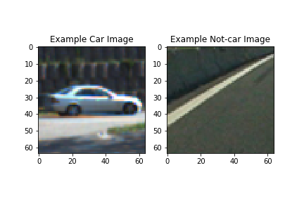
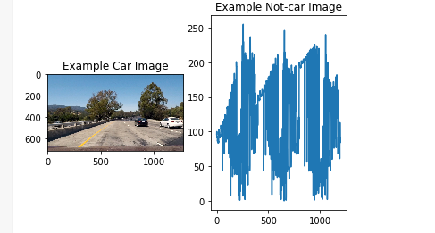
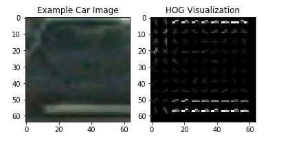
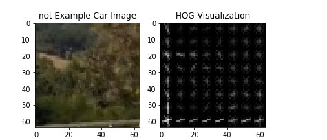
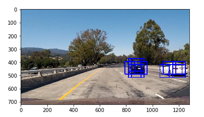

# Vehicle Detection Project


1- I applied a color transform and append binned color features, as well as histograms of color and I Perform a Histogram of 
Oriented Gradients (HOG) feature extraction and I concatnated all of them in one array. 

2- I normalized all features

3- I split the features into training and testing sets randomly

4- I used Linear SVM classifier to the train set and I calculated the accuracy on test set

5-I Implemented a sliding-window technique and I used my trained classifier to search for vehicles in images.

6- I used heat map to remove false postive frames

7-Run a pipeline on a video stream 

# 2- Histogram of Oriented Gradients (HOG) And binned color features And histogram

I read my data set and put them into two arrays cars[] and notcat[] ( code cell number 1). 


```python
from IPython.core.display import Image
Image(filename=('write_up/car and notcar example.png'))
```





I perform spatial binning and histogram on the images to get some features that will help me to classify car from an image. 
I used bin_spatial() and color_hist() functions (this part found in code cell number 2 and 3).I used get_hog_features() function
( code cell number 2 ) to extract HOG features and I choosed this paramters in HOG orient = 9 , pix_per_cell = 8 and
cell_per_block = 2 ( code cell number 4). I found this parameter is good because it have the shape or fingerprint without 
overfitting some they have alot of generalization .


```python
from IPython.core.display import Image
Image(filename=('write_up/bins.png'))
```





```python
from IPython.core.display import Image
Image(filename=('write_up/HOG car image.png'))
```





```python
from IPython.core.display import Image
Image(filename=('write_up/HOG not car image.png'))
```





# 3- classifing and training the data

I normalized all the features and split the features into training and test sets then I trained the training data 
a linear SVM using(code cell number 6) 

# 4- Sliding Window Search

I used find_cars() function (code cell number 10) to find cars it extract features and  use the classifier to perdict cars in each window in the image. ystart(where I start in y-axis) = 300 , ystop(where I stop in y-axis) = 600 and scale = 1.5 
(weight for each window).


```python
from IPython.core.display import Image
Image(filename=('write_up/slide window search.png'))
```





# 5- Video Implementation

I have used the heatmap to filter false positives (code cell number 11 ) and I thresholded that map  to identify vehicle positions (code cell number 11 ) then I have used vechile_detection() function (code cell number 12) to make the project video.


```python
from IPython.core.display import Image
Image(filename=('write_up/heat map 1.png'))
```


```python
from IPython.core.display import Image
Image(filename=('write_up/heat map 2.png'))
```


# Discussion

I faced two problems in the project firstly I was not able to make all features have the same dimenstion to concatnate them. 
I faced another problem that when I made the spatial_size and hist_bins = 32 I get memory error so I decrease untill I did not
find this error.

I think the model will fail if there is a car have different shape or not ordinary shape from those the model trained 

To improve the model we can train it on diffrent types of cars. we also have to train it on day and night time so we generalize
it.
